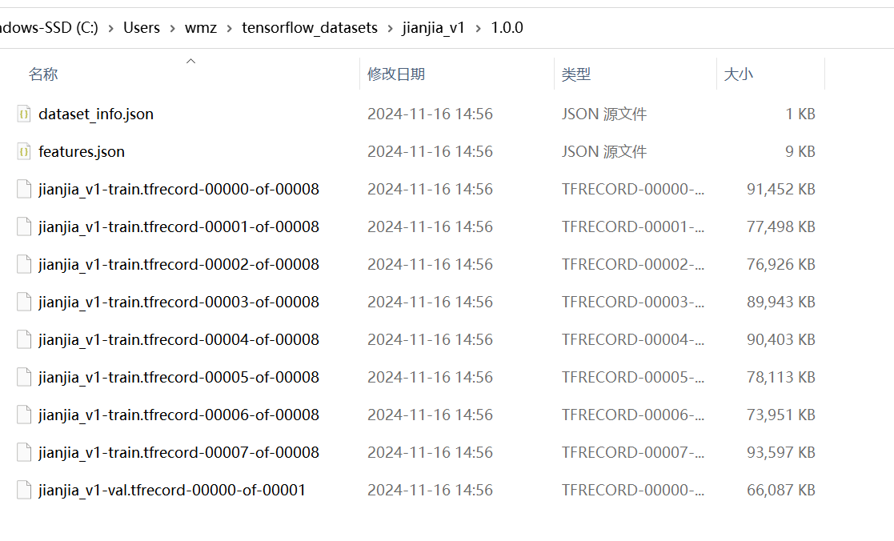

# 配置代码执行的虚拟环境

1. 使用配置文件创建虚拟环境

```bash
conda env create -f environment_ubuntu.yml
conda activate rlds_env
```
2. 或者自己创建环境并安装必要的包

```bash
tensorflow,tensorflow_datasets, tensorflow_hub, apache_beam, matplotlib, plotly, wandb
```

3. 执行脚本将数据生成npy格式
   
create_jianjia_v1.py脚本中需要修改数据存放路径，数据来自指定格式采集生成的数据。
文件路径格式，其中xx代表数字，
```bash
|-fineTuneData
  |-examplexx
    |-image_x.png
    |-...
    |-robot_motion_data.json
```
在虚拟环境下执行脚本。
```bash
cd jianjian_v1
python create_jianjia_v1.py
```

4. 执行命令生成tfrecord格式的数据集（真正octo微调需要的数据）。

```bash
tfds build
```

在windows下测试通过



